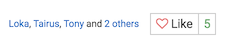
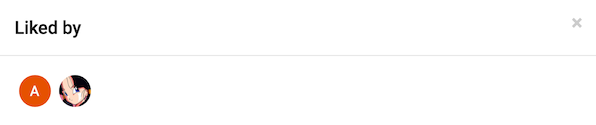

# NodeBB: Likes

Traditional Like system, as you can find on social networks. It uses same reputation system.

<!-- START doctoc generated TOC please keep comment here to allow auto update -->
<!-- DON'T EDIT THIS SECTION, INSTEAD RE-RUN doctoc TO UPDATE -->
 

- [Themes](#themes)
- [Screenshots](#screenshots)

<!-- END doctoc generated TOC please keep comment here to allow auto update -->

## Themes

Installation of plugin is pretty straightforward. You should add template import to `Post Template`. For example, you can find `post template` for **Persona Theme** under this path: `nodebb-theme-persona/templates/partials/topic/post.tpl`

Import:

    <!-- IMPORT partials/topic/likes_post.tpl -->
    
Add it wherever you like, but don't forget to delete default one, with chevrons.

## Screenshots

By default, it looks like:

Additional list:

